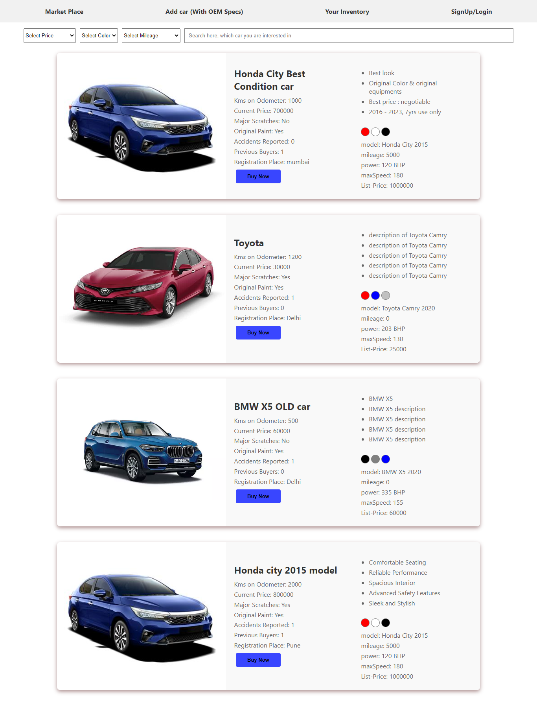
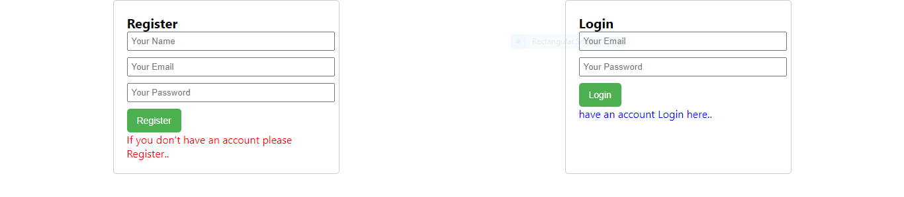
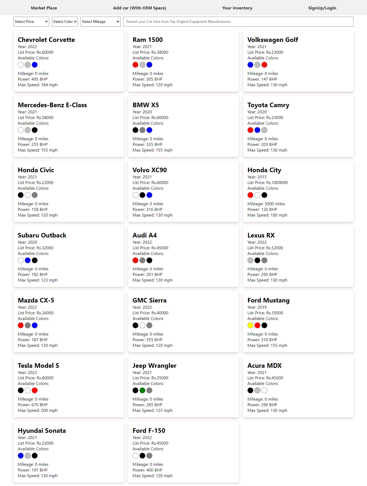
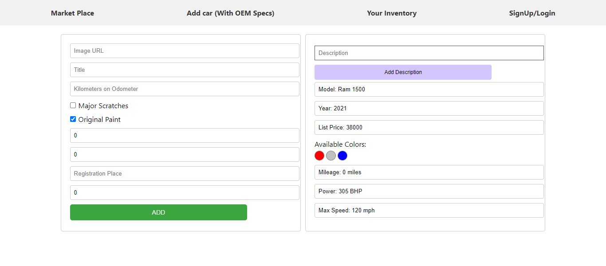
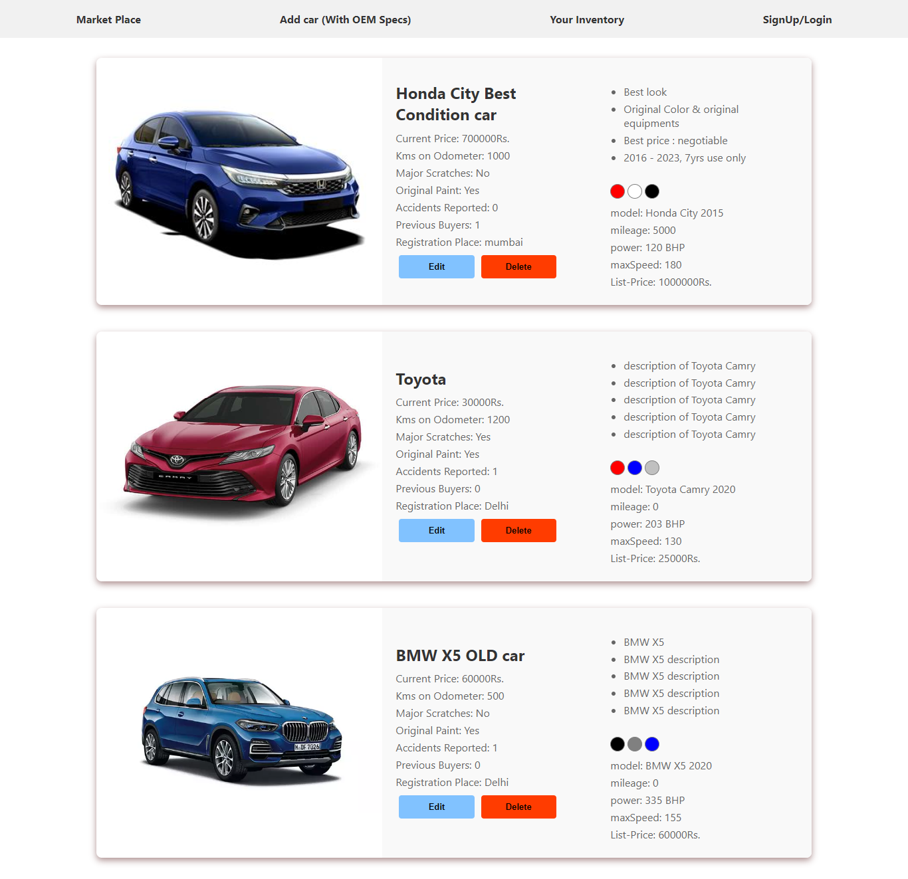
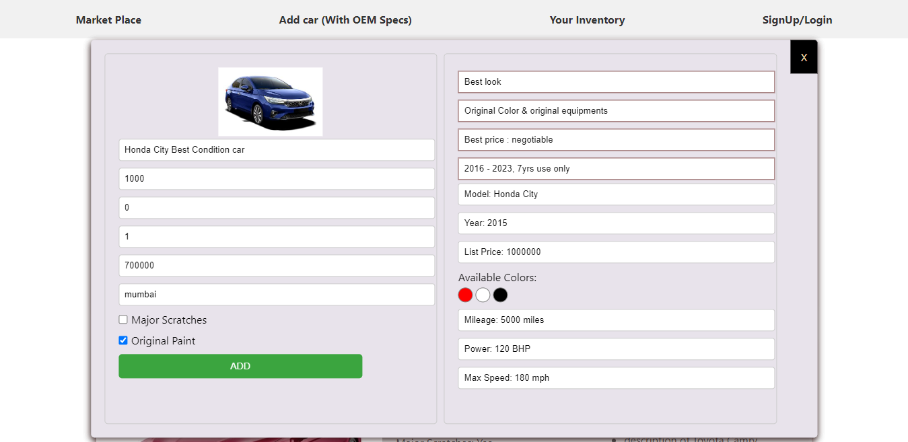

# Project Name ->  Attryb Assignment
##  Created by : 
Swarup Kadoli.
 
##  Steps to follow
- `git clone` 
- `npm i`

### Deployed Links:
- https://attryb-assignment-frontend.vercel.app/

### Backend Links Deployment:
- https://attryb-assignment.vercel.app
 

## Details:
This is a Readme for my assignment given by `https://attryb.com` & completed successfully within given duration. It was really greate experience for me. Below described the Features of this project.

 

## Tech-Stack:

- React.js (create-react-app)
- React Routing (react-router-dom)
- React Redux 
- React Redux Thunk
- CSS
- HTML

- MongoDB
- mongoose
- Express.js
- Node.js

Glimpse and Screenshots of this website:

## Navbar:

- This is the landing page of our website. Clicking an option on the Navbar will redirect to the respective page.

## Market-Place:

- The images on the home page are linked to all Pages. Hence clicking on it will ensure successful redirection to the next Page.
- Here Dealer can choose a car from OEM Data
- Dealer can Filter OEM data with Price | Color | Mielage
- Dealer can Search by car title/year/any other field

## Signup & Login page:
- Here we have a page where Dealer can Register & login

## OEM_Specs Page:
- Here Dealer can choose a car from OEM Data
- Dealer can Filter OEM data with Price | Color | Mielage
- Dealer can Search by car title/year/any other field

## Add car in Dealer's Inventory Page:
- Dealer choose a car from OEM data & add his/her cars conditions.

## Dealer's Inventory Page:

## Edit in Dealer's Inventory Page:
- Dealer choose a car from his/her Inventory & edit.

## ... Thank You ...